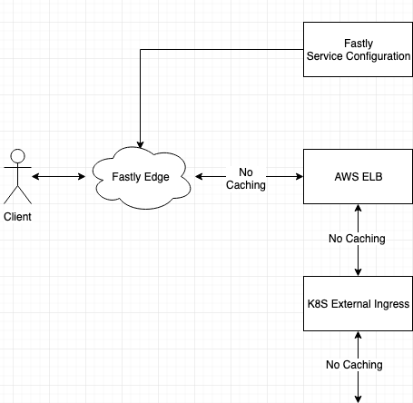

# fastly serve stale

The following is a proof of concept to test the configuration of the ability
for Fastly to serve stale content if a backend origin is considered down.

The purpose of this is to still serve content at the Edge when everything has
gone to sh!t at the actual webserver infrastructure end.

https://docs.fastly.com/en/guides/serving-stale-content#serving-stale-content-on-%20errors%E2%80%8B

## Setup



* `cached.html` has a cache expiration of 10 seconds and shows a cat image
  which itself also has an expiration of 10 seconds
* curl will be used repeatedly against the object every 2 seconds

## Baseline

### Normal Flow

_no serve stale_

* Client requests an object from the Edge
* Edge will check the Cache-Control header of the object and determine if it
  has expired
* If it has expired then a request to Origin will be made for the object
* The Edge will cache the object and give it back to the Client

Following is logging entries from the origin showing a refresh of the object
from the Edge ~ once every 10 seconds (which matches the expiration time)

```
fastly-serve-stale-blue-app-app-5559dc659f-nlrg4 blue-app 2019-10-14T04:47:20.661991965Z 100.96.18.17 - - [14/Oct/2019:04:47:20 +0000] "GET /cached.html HTTP/1.1" 304 0 "-" "curl/7.54.0" "203.26.177.177"
fastly-serve-stale-blue-app-app-5559dc659f-sclwv blue-app 2019-10-14T04:47:30.910251836Z 100.96.18.17 - - [14/Oct/2019:04:47:30 +0000] "GET /cached.html HTTP/1.1" 304 0 "-" "curl/7.54.0" "203.26.177.177"
fastly-serve-stale-blue-app-app-5559dc659f-nlrg4 blue-app 2019-10-14T04:47:41.230967977Z 100.96.18.14 - - [14/Oct/2019:04:47:41 +0000] "GET /cached.html HTTP/1.1" 304 0 "-" "curl/7.54.0" "203.26.177.177"
fastly-serve-stale-blue-app-app-5559dc659f-nlrg4 blue-app 2019-10-14T04:47:51.60706738Z 100.96.14.8 - - [14/Oct/2019:04:47:51 +0000] "GET /cached.html HTTP/1.1" 304 0 "-" "curl/7.54.0" "203.26.177.177"
fastly-serve-stale-blue-app-app-5559dc659f-j7j9d blue-app 2019-10-14T04:48:01.844475112Z 100.96.14.8 - - [14/Oct/2019:04:48:01 +0000] "GET /cached.html HTTP/1.1" 304 0 "-" "curl/7.54.0" "203.26.177.177"
fastly-serve-stale-blue-app-app-5559dc659f-sclwv blue-app 2019-10-14T04:48:12.076055798Z 100.96.18.17 - - [14/Oct/2019:04:48:12 +0000] "GET /cached.html HTTP/1.1" 304 0 "-" "curl/7.54.0" "203.26.177.177"
fastly-serve-stale-blue-app-app-5559dc659f-j7j9d blue-app 2019-10-14T04:48:22.366520283Z 100.96.18.14 - - [14/Oct/2019:04:48:22 +0000] "GET /cached.html HTTP/1.1" 304 0 "-" "curl/7.54.0" "203.26.177.177"
fastly-serve-stale-blue-app-app-5559dc659f-j7j9d blue-app 2019-10-14T04:48:32.719445526Z 100.96.18.14 - - [14/Oct/2019:04:48:32 +0000] "GET /cached.html HTTP/1.1" 304 0 "-" "curl/7.54.0" "203.26.177.177"
fastly-serve-stale-blue-app-app-5559dc659f-nlrg4 blue-app 2019-10-14T04:48:43.396984012Z 100.96.18.17 - - [14/Oct/2019:04:48:43 +0000] "GET /cached.html HTTP/1.1" 304 0 "-" "curl/7.54.0" "203.26.177.177"
fastly-serve-stale-blue-app-app-5559dc659f-sclwv blue-app 2019-10-14T04:48:53.765310701Z 100.96.18.17 - - [14/Oct/2019:04:48:53 +0000] "GET /cached.html HTTP/1.1" 304 0 "-" "curl/7.54.0" "203.26.177.177"
fastly-serve-stale-blue-app-app-5559dc659f-sclwv blue-app 2019-10-14T04:49:04.067923816Z 100.96.18.14 - - [14/Oct/2019:04:49:04 +0000] "GET /cached.html HTTP/1.1" 304 0 "-" "curl/7.54.0" "203.26.177.177"
fastly-serve-stale-blue-app-app-5559dc659f-sclwv blue-app 2019-10-14T04:49:10.533831731Z 100.96.18.14 - - [14/Oct/2019:04:49:10 +0000] "GET /cached.html HTTP/1.1" 304 0 "-" "curl/7.54.0" "203.26.177.177"
```

### Failure Flow

_no serve stale_

* pods will be scaled in to 0 which should simulate an origin failure
* I expect to get 501 / 502 http responses

Almost immediately:
```
<html>
<head><title>503 Service Temporarily Unavailable</title></head>
<body>
<center><h1>503 Service Temporarily Unavailable</h1></center>
<hr><center>nginx/1.15.10</center>
</body>
```


With origin down:
```
R5006663:fastly-serve-stale lee.webb$ curl -v -k -H Fastly-Debug:1 http://fastly-serve-stale-test-v1.cdn.9pub.io/cached.html
*   Trying 151.101.30.133...
* TCP_NODELAY set
* Connected to fastly-serve-stale-test-v1.cdn.9pub.io (151.101.30.133) port 80 (#0)
> GET /cached.html HTTP/1.1
> Host: fastly-serve-stale-test-v1.cdn.9pub.io
> User-Agent: curl/7.54.0
> Accept: */*
> Fastly-Debug:1
>
< HTTP/1.1 200 OK
< Cache-Control: max-age=10, public
< Content-Type: text/html
< ETag: "5d9e8293-3d"
< Expires: Tue, 15 Oct 2019 00:49:48 GMT
< Last-Modified: Thu, 10 Oct 2019 01:00:03 GMT
< Pragma: public
< Server: nginx/1.16.1
< Content-Length: 61
< Accept-Ranges: bytes
< Date: Tue, 15 Oct 2019 00:54:53 GMT
< Via: 1.1 varnish
< Age: 93
< Connection: keep-alive
< Fastly-Debug-Path: (D cache-syd18926-SYD 1571100894) (F cache-syd18927-SYD 1571100579)
< Fastly-Debug-TTL: (H cache-syd18926-SYD - - 93)
< Fastly-Debug-Digest: 66d6eced06ad9c5b22eb804df9176bb888fb7c29ea7c77b1043088750a19fc4a
< X-Served-By: cache-syd18926-SYD
< X-Cache: HIT
< X-Cache-Hits: 1
< Vary: Accept-Encoding
<
<html>
  <head/>
  <body></body>
</html>
* Connection #0 to host fastly-serve-stale-test-v1.cdn.9pub.io left intact
```

With origin up:
```
R5006663:fastly-serve-stale lee.webb$ curl -v -k -H Fastly-Debug:1 http://fastly-serve-stale-test-v1.cdn.9pub.io/cached.html
*   Trying 151.101.30.133...
* TCP_NODELAY set
* Connected to fastly-serve-stale-test-v1.cdn.9pub.io (151.101.30.133) port 80 (#0)
> GET /cached.html HTTP/1.1
> Host: fastly-serve-stale-test-v1.cdn.9pub.io
> User-Agent: curl/7.54.0
> Accept: */*
> Fastly-Debug:1
>
< HTTP/1.1 200 OK
< Cache-Control: max-age=10, public
< Content-Type: text/html
< ETag: "5d9e8293-3d"
< Expires: Tue, 15 Oct 2019 00:49:48 GMT
< Last-Modified: Thu, 10 Oct 2019 01:00:03 GMT
< Pragma: public
< Server: nginx/1.16.1
< Content-Length: 61
< Accept-Ranges: bytes
< Date: Tue, 15 Oct 2019 00:56:05 GMT
< Via: 1.1 varnish
< Age: 9
< Connection: keep-alive
< Fastly-Debug-Path: (D cache-syd18926-SYD 1571100965) (F cache-syd18927-SYD 1571100579)
< Fastly-Debug-TTL: (H cache-syd18926-SYD 1.019 43200.000 9)
< Fastly-Debug-Digest: 66d6eced06ad9c5b22eb804df9176bb888fb7c29ea7c77b1043088750a19fc4a
< X-Served-By: cache-syd18926-SYD
< X-Cache: HIT
< X-Cache-Hits: 4
< Vary: Accept-Encoding
<
<html>
  <head/>
  <body></body>
</html>
* Connection #0 to host fastly-serve-stale-test-v1.cdn.9pub.io left intact
```
